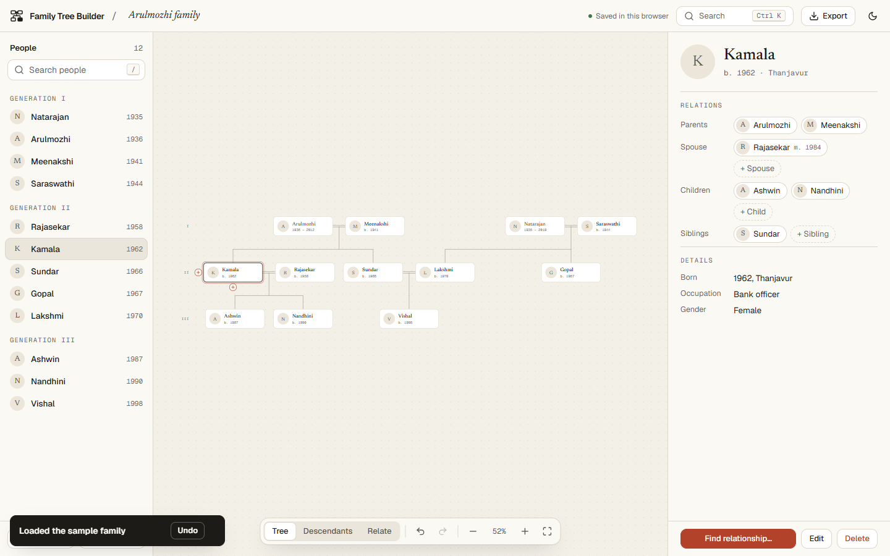
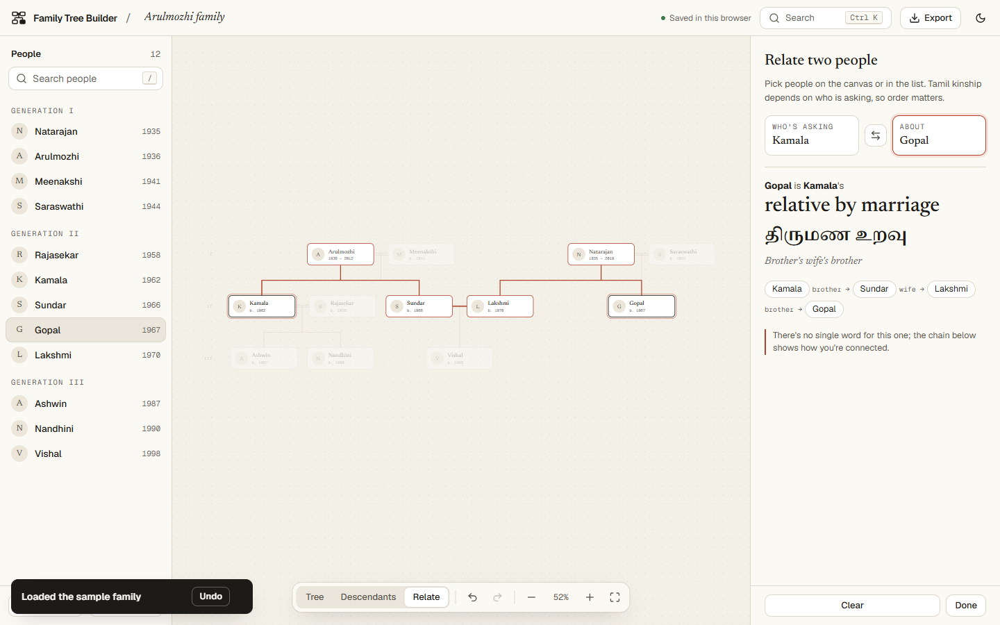
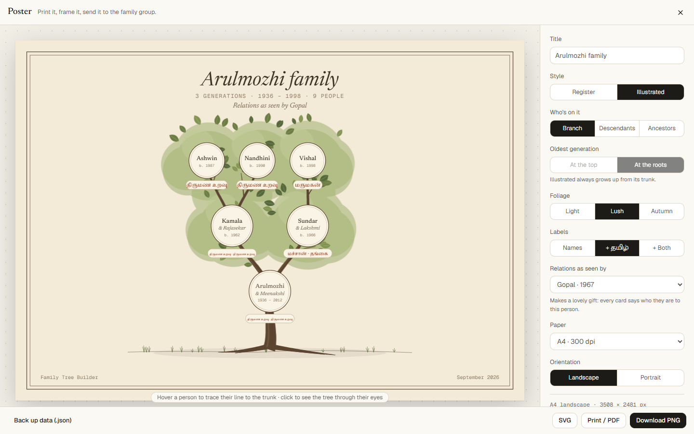

# Family Tree Builder

Build your family tree, see exactly how two people are related — in English **and தமிழ்** — and print the whole family as a poster. Everything stays in your browser.

**Live:** https://sa-fam-tree-builder.vercel.app/



## What it does

- **Editor.** Click a person to see their relations; `+` handles on the card add a parent, spouse or child right where they belong. Arrow keys move between relatives, `Ctrl K` finds anyone, `Ctrl Z` undoes anything.
- **Relate.** Pick two people and get the relationship — e.g. *Gopal is Vishal's maternal uncle · மாமா* — with the chain that connects them highlighted on the tree. Tamil terms follow who is asking, which side of the family, and who is older (சித்தப்பா vs பெரியப்பா, parallel vs cross cousins, in-law terms by speaker).
- **Descendants.** Re-root the tree on any person to see just their line.
- **Poster.** Print or download (PNG, SVG, PDF) as a clean *Register* chart or an *Illustrated* grown tree, labelled in Tamil from any one person's point of view.
- **Private by default.** No account, no server copy. It autosaves in this browser (IndexedDB); export a JSON backup and import it anywhere.




## Run it locally

Requires Node.js 20+.

```bash
git clone https://github.com/AHILL-0121/Family-Tree-Builder.git
cd Family-Tree-Builder/frontend
npm ci
npm run dev        # http://localhost:3000
```

The contact form on the landing page needs SMTP settings — copy `frontend/.env.example` to `frontend/.env.local` and fill in `SMTP_USER`, `SMTP_PASS` and `CONTACT_TO`. Without them the form replies "not configured"; everything else works.

## Development

```bash
npm run typecheck   # tsc --noEmit
npm run lint        # eslint (next/core-web-vitals)
npm test            # vitest: graph, import, relationships (60+ golden Tamil/English cases), layout, poster
npm run build
```

CI (`.github/workflows/ci.yml`) runs all four on every push and pull request.

More detail on the code layout is in [`frontend/README.md`](frontend/README.md).

## License

[MIT](LICENSE) · Made by [AHILL-0121](https://github.com/AHILL-0121)
